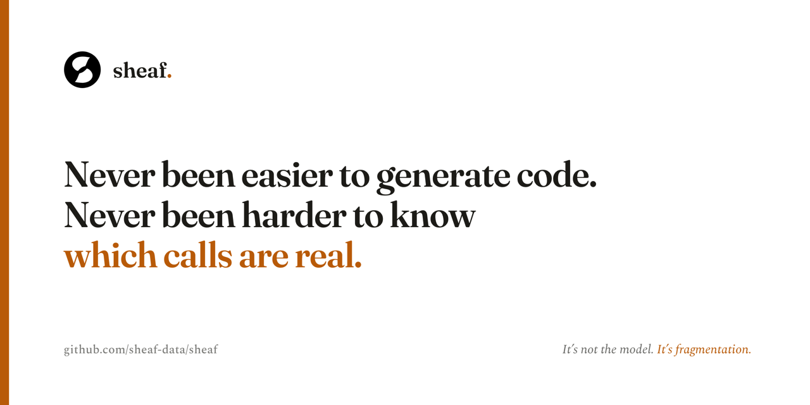
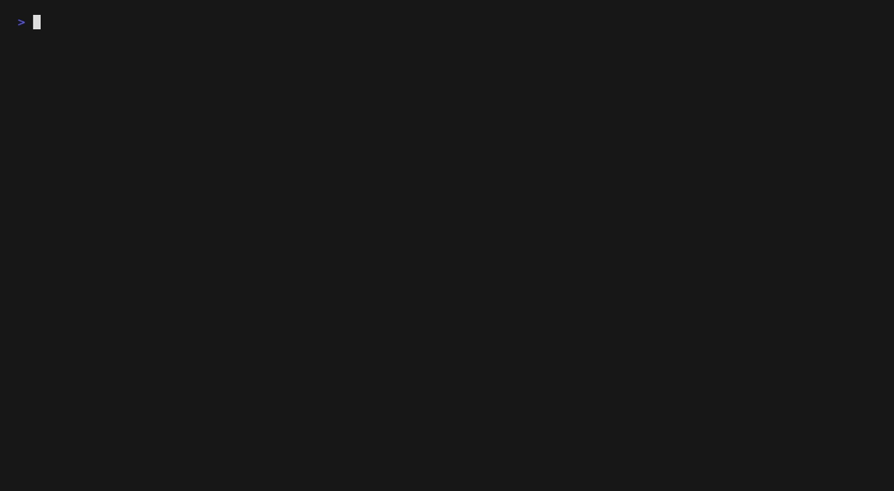
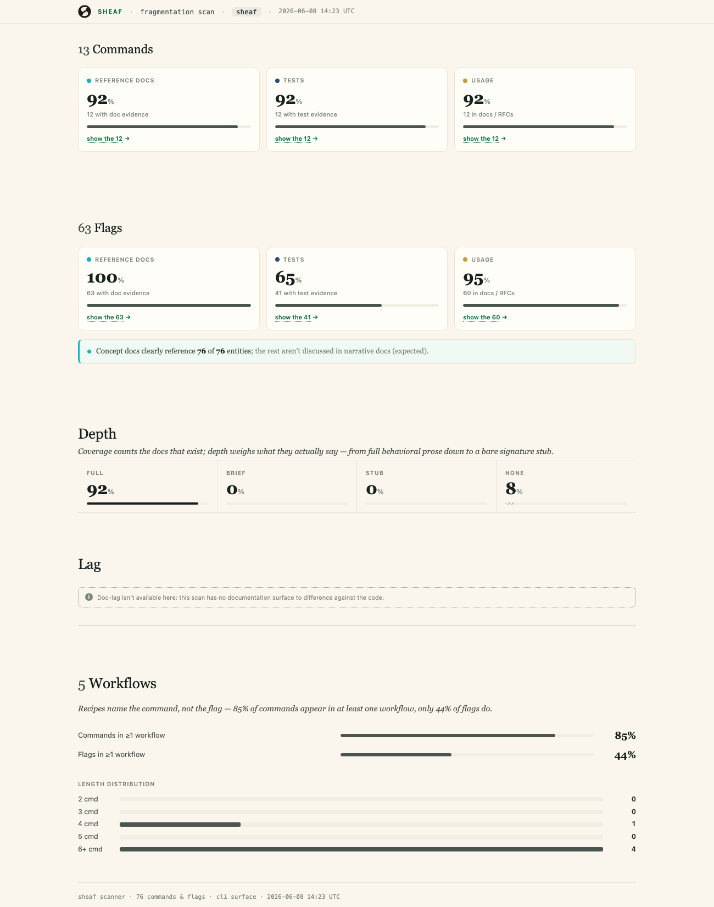

<p align="center">
  
</p>

# Sheaf

[](https://github.com/sheaf-data/sheaf/actions/workflows/ci.yml)
[](LICENSE)

**Your coding agent hallucinates APIs because your project is fragmented, not because the model isn't smart enough.** The docs, tests, and examples exist; they just don't point at the same things. Sheaf maps your real contract surface (every CLI command, API method, config knob) and shows, element by element, which ones a doc explains, a test verifies, and a working example demonstrates. The empty cells are where agents guess and humans open three tabs and a grep window.

It runs as a CLI and ships an [MCP server](#mcp-server), so the same map your team reads is the ground truth your agent reads *before* it answers.

<p align="center">
  
</p>

<p align="center"><sub>Demoed on Sheaf's own repo: 76 commands, scanned in ~130 ms. Larger repos take longer; every sample is reproducible (<a href="docs/examples/REPRODUCIBILITY.md">recipe</a>).</sub></p>

## Getting started

```sh
go install github.com/sheaf-data/sheaf/cmd/sheaf@latest
sheaf scan --auto --llm-backend none --repo .   # zero-config, deterministic, no model
open sheaf-auto/sheaf-report.html               # the report + the sheaf.textproto it generated
```

`--auto` autodetects the common deterministic surfaces (Rust clap CLIs, protobuf / gRPC, FIDL, and C++ headers), runs the scan, and writes a self-contained report next to the `sheaf.textproto` it generated, so a second run is just `sheaf scan`. `--llm-backend none` keeps the first run fast and dependency-free: the contract↔test↔doc join is deterministic, so no model is contacted. (Drop the flag to add a citation-gated LLM attribution pass: `ANTHROPIC_API_KEY` for a fast frontier pass, or a local ollama model.)

**That first report is a starting point, not the finished product.** Other contract surfaces (cobra CLIs like gh, Kubernetes CRDs, Helm values, OpenAPI) aren't autodetected; they're wired by config. And either way, a scan you'd forward to your team is real configuration work: the right include/exclude globs, a source map that groups by feature area, and a spot-check that every claimed bridge is real; a wrong glob *silently* under-counts. That's a job worth handing to a coding agent.

> **Onboard your repo with the `sheaf-onboard` skill (recommended).** Your agent does the reconnaissance and config, runs the scan, then runs `sheaf verify` to check every headline number against disk *before* it shows you the report, so your spot-check is a confirmation, not a discovery. If config alone can't reach a surface, it offers a `sheaf-build-adapter` handoff instead of quietly under-counting.
>
> ```sh
> docs/examples/sheaf-onboard/install.sh   # then, in Claude / Cursor / Cline:  /sheaf-onboard
> ```
>
> Any agentic CLI (Gemini, Codex) drives it via [`AGENTS.md`](docs/examples/sheaf-onboard/AGENTS.md). Prefer to wire it by hand? See [docs/scan-your-repo.md](docs/scan-your-repo.md).

From a clone, build instead of install: `go build -o sheaf ./cmd/sheaf` (same flags, `./sheaf` instead of `sheaf`). Common questions and the symptom → fix table are in [docs/faq.md](docs/faq.md); known rough edges are tracked in [KNOWN_LIMITATIONS.md](KNOWN_LIMITATIONS.md).

## Why Sheaf?

Your agent hallucinates an API and the easy story is that the model isn't smart enough. But the developer next to it just spent forty-five minutes on the same call with no model in the loop. The model isn't what failed; the *project* did. The docs, tests, and examples exist; they just drifted apart:

- **Time drift**: the artifact and the code were aligned and have separated since. The tutorial worked in v1.2; the API moved in v2; the tutorial didn't move with it.
- **Domain drift**: both are current, but live in different vocabularies. The guide says "invite people to a meeting"; the reference says `events.insert` with an `attendees[]` array. Neither is wrong; nobody owns the bridge between them.

Both are properties of the project, not the consumer; a smarter model just makes the guesses faster and the errors more confident. Sheaf builds the bridge nobody owns: a record of which artifacts refer to which contract elements, surfaced as a map you can audit and an agent can read *before* it answers. The full argument is in **[It's not the model](its-not-the-model.md)**; see it on real projects in the [sample reports](#sample-reports) below.

## Sample reports

Each row links to a Sheaf report produced against a real project (the self-scan links its recipe). Click the sample name to open it; the worklist, coverage matrix, and findings reflect that project's actual state at scan time. The config and rules used to produce each report are linked alongside: clone, point Sheaf at the same config, and you should reproduce the same numbers.

<p align="center">
  
</p>

| Sample | Ecosystem | Contract surface | Config |
|---|---|---|---|
| **[envoy ↗](example-reports/envoy.html)** | proto | Envoy xDS v3 protobuf API: the v3 management-plane services. | [textproto](docs/examples/envoy-coverage-config.textproto) |
| **[gh (GitHub CLI) ↗](example-reports/gh.html)** | cli | The GitHub CLI's subcommand + flag surface, scanned from its checked-in cobra YAML reference. | [textproto](docs/examples/gh-coverage-config.textproto) |
| **[sheaf (self-scan) ↗](docs/examples/self-scan/)** | cli | Sheaf dogfooding itself: its own CLI surface joined against its own tests, docs, and worked examples. The canonical "what a complete config looks like for a cobra-style CLI." | [textproto](docs/examples/self-scan/sheaf.textproto) |

*Run Sheaf on your own repo: [docs/scan-your-repo.md](docs/scan-your-repo.md).*

To reproduce any sample locally (in-process, no server). Here, Sheaf's own self-scan:

```sh
sheaf snapshot --config docs/examples/self-scan/sheaf.textproto --library sheaf --out /tmp/sheaf-self.json
sheaf render --from-snapshot /tmp/sheaf-self.json --ecosystem cli -o sheaf-self.html   # → 76 commands · 53 bridged · 23 gaps
```

Pass the `--ecosystem` that matches the sample (the **Ecosystem** column above); the source map beside each config is auto-resolved. All sample configs and rules live under [docs/examples/](docs/examples/).

## MCP server

Sheaf exposes its in-memory index as an MCP server so coding agents (Claude, Cursor, Cline, anything that speaks MCP) can ground their answers in the real contract surface, real tests, and real docs, not plausibilities. Start it with `sheaf serve --repo .` and point your agent at `http://127.0.0.1:7700`; queries include contract elements, coverage profiles, and worked examples per element. Server config (bind, port, auth) lives in the `mcp_server { ... }` block; see [docs/config.md](docs/config.md).

Full wire protocol, every JSON-RPC operation, return payload shapes, and proto schema indexes are at [docs/mcp/api.md](docs/mcp/api.md) and [docs/mcp/schema.md](docs/mcp/schema.md).

## PR-bot

`sheaf review --base <base-repo-root> --repo <head-repo-root>` renders a coverage-delta comment for a pull request: which contract elements gained or lost docs, tests, or usage between the two corpora. You point it at two repo roots (the PR base and head working trees), not bare git refs; the refs are recorded separately via the `--emit-base-ref` / `--emit-head-ref` flags. Wire it into CI to post on PR open and on push.

A worked end-to-end example lives under [docs/examples/sheaf-bot-demo/](docs/examples/sheaf-bot-demo/): a base/head commit pair with the request, the rendered comment, and the demo script checked in side-by-side.

## Monorepo fan-out

`sheaf scan --manifest <file>` reads a `MonorepoManifest` textproto and runs a scan + render for every entry, producing one report per module plus an `index.html` linking them, all in-process, no `sheaf serve` per module. It is the automated counterpart to the interactive `scripts/regen-example-reports.sh` (which stays the exploratory path).

The manifest format is generic: Cargo workspaces, Bazel monorepos, and Lerna packages plug into the same runner by supplying their own list-generator that emits a `MonorepoManifest`.

See [docs/cli/reference/sheaf_scan.md](docs/cli/reference/sheaf_scan.md) for the manifest schema, a worked end-to-end example, and the continue-on-failure semantics.

## CLI reference

Every subcommand and helper binary has its own reference page:

- [docs/cli/sheaf.md](docs/cli/sheaf.md): overview of the `sheaf` binary.
- [docs/cli/reference/](docs/cli/reference/): one page per subcommand (`scan`, `gaps`, `coverage`, `report`, `snapshot`, `render`, `serve`, `review`, `review-html`, `init`, `doctor`, `version`) plus the companion binaries (`scanner`, `dump-elements`, `dump-profile`, `kubectl-yamlgen`).
- [docs/cli/workflows.md](docs/cli/workflows.md): end-to-end recipes that combine the binaries.
- [docs/cli/self-monitoring.md](docs/cli/self-monitoring.md): how sheaf is configured to scan its own CLI surface.

## MCP reference

- [docs/mcp/README.md](docs/mcp/README.md): at-a-glance map for picking the right operation.
- [docs/mcp/api.md](docs/mcp/api.md): JSON-RPC wire protocol, every method, params, return shape, error codes, auth.
- [docs/mcp/schema.md](docs/mcp/schema.md): proto messages the operations return.
- [docs/mcp/tools.md](docs/mcp/tools.md): per-tool input JSON Schemas + example prompts for grounding an agent.

## Repo layout

```
.                       Go module (github.com/sheaf-data/sheaf)
├── cmd/sheaf/          Main binary
├── cmd/dump-elements/  Debug helper (FIDL adapter)
├── cmd/dump-profile/   Debug helper (coverage dump)
├── cmd/kubectl-yamlgen/  Generates per-subcommand YAML for cobra-CLI scans
├── internal/adapters/  Contract / test / doc / rendered-reference adapters
│   ├── argh/           Rust argh-derived CLI surface
│   ├── bats/           Bash test framework
│   ├── clap/           Rust clap-derived CLI surface
│   ├── clidoc/         Fuchsia clidoc tarball
│   ├── cobra/          spf13/cobra YAML reference (gh, …)
│   ├── conceptdoc/     Concept/overview prose attribution
│   ├── crd/            Kubernetes CRD openAPIV3Schema fields
│   ├── fidl/           FIDL contract source
│   ├── fidldoc/        Fuchsia fidldoc bundle
│   ├── gotest/         Go test functions + cobra-invocation extractor
│   ├── gtest/          C++ googletest
│   ├── helmvalues/     Helm chart values.schema.json knobs
│   ├── implementsmap/  C++ class → FIDL element bridging
│   ├── k8smanifest/    Rendered Kubernetes YAML field inventory
│   ├── markdown/       Generic markdown prose
│   ├── markdowncli/    Per-subcommand markdown reference (CLI-manual style)
│   ├── pwfacade/       Pigweed pw_facade() GN parser (build-graph hint)
│   ├── pytest/         Python pytest discovery + ref extraction
│   ├── rusttest/       Rust #[test] attributes
│   └── …               and more (cml, cppheader, protocpp, rst, workflows, …): `ls internal/adapters/` for the full set
├── internal/buildgraph/  Build-graph recognizer framework
├── internal/indexer/   Cross-reference engine (join logic)
├── internal/analyze/   Findings: tested-undocumented, thin-reference, stale-doc, …
├── internal/cli/       Sub-command implementations
├── internal/mcp/       MCP server
├── internal/prbot/     PR-bot comment renderer + adapters
├── internal/report/    HTML report writer
├── internal/orchestrator/  Pipeline driver
├── proto/              Schema (.proto + generated bindings)
└── utils/scanner/      HTML report generator (consumes MCP)

docs/
├── playbooks/onboard-a-new-repo.md  How a team extends Sheaf to their repo
├── examples/                      Working configs + recipes (gh, envoy, self-scan, …)
├── cli/                           Per-binary + per-subcommand reference
├── mcp/                           MCP wire protocol + schema
└── config.md                      Top-level config reference
```

## Extending to a new CLI

See [docs/playbooks/onboard-a-new-repo.md](docs/playbooks/onboard-a-new-repo.md) for an end-to-end walk-through.

The pattern (for cobra-based CLIs):

1. Generate per-subcommand YAML via `doc.GenYamlTree`
2. Write `sheaf.textproto` with `contract_anchor { name: "cobra" ... }`, `rendered_reference { name: "markdowncli" ... }`, and `test_parser { name: "gotest" binary_name: "..." }`
3. Add the project's source map (`categorization-rules.textproto`) bucketing subcommands by family
4. `sheaf scan` and iterate

A reference config for a cobra CLI is at [docs/examples/gh-coverage-config.textproto](docs/examples/gh-coverage-config.textproto).

## License

Apache 2.0. See [LICENSE](LICENSE).
