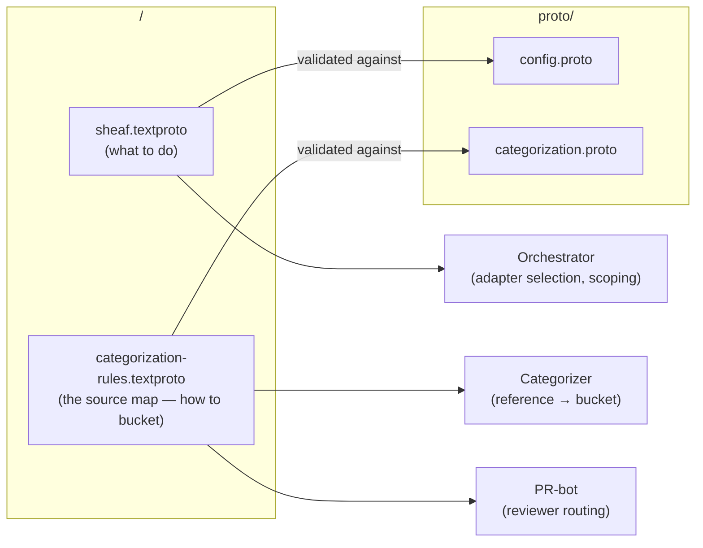

# Sheaf — Configuration

**Status:** Draft v0.1
**Audience:** Project maintainers configuring Sheaf; adapter authors defining per-adapter config schemas; implementers
**Companion docs:** [architecture.md](architecture.md), [KNOWN_LIMITATIONS.md](../KNOWN_LIMITATIONS.md)
**Last updated:** 2026-06-04

---

## 1. Overview

Sheaf's behavior against a given project is fully determined by two textproto files at the project repo root:

| File | Schema | Purpose | Change cadence |
|---|---|---|---|
| `sheaf.textproto` | `proto/config.proto` | Adapter selection, scope, server settings, integrations | Rare after initial setup |
| `categorization-rules.textproto` (the project's **source map**) | `proto/categorization.proto` | Path patterns → taxonomy buckets, ownership routing | Grows alongside the project |

Both files are committed to the project repo (the project-config storage tier). Both are partially scaffolded by `sheaf init --template <name>` and then hand-edited. Both round-trip losslessly to binary proto and to JSON via `protojson`.

This document specifies:

- The full schema of both files, with rationale for each block (§4, §5).
- The loading model: file resolution, precedence, env-var expansion, validation (§3, §7).
- The per-adapter config story — how adapters declare their config slice, how new adapters slot in (§6).
- Schema evolution and migration (§8).
- Where the canonical `.proto` definitions live (§9).
- Starter templates shipped with v1 (§10) and worked examples (§11).

**Design context.** This doc incorporates the post-Phase-0 design resolutions:

- **D2** — LLM cache key is `(source_hash, prompt_version, model_id)`; see §4.13.
- **D3** — Substance thresholds are per-`(ecosystem, ContractElementKind)` with the 5/20 fuchsia.io numbers as defaults; see §4.10.
- **D4** — When a coverage profile has entries in multiple categories with ownership rules, all matched owners are added as suggested reviewers, deduplicated by handle; see §5.2.
- **D5** — MCP server supports `NONE` (default, localhost-only) and `BEARER` auth modes in v1; see §4.11.
- **D6** — Annotation block exists in the schema but is rejected at startup unless v2+ activation conditions are met; see §4.14.

---

## 2. The two files at a glance



**Why two files, not one.** `sheaf.textproto` rarely changes after setup; the source map (`categorization-rules.textproto`) grows with the project's docs/tests layout. Different change cadences mean different review patterns. Separating them keeps PR friction proportional to the actual scope of the change.

**Why textproto, not YAML/JSON/TOML.** Single source of truth via `.proto`; type-strict; comments work; round-trips losslessly to other proto serializations.

---

## 3. Loading model

### 3.1 File resolution

`sheaf` resolves config files in this order:

1. **`--config <path>`** flag — if present, used verbatim. If the file doesn't exist, startup fails.
2. **`./sheaf.textproto`** in the repo root (where "repo root" is `--repo <path>`, defaulting to `cwd`). Required.
3. **`./categorization-rules.textproto`** (the source map) in the same repo root. Required.

The `--config` flag overrides only the location of `sheaf.textproto`. The source map is always resolved relative to `--repo`, with no flag to override its location in v1. (Open question: §12.)

### 3.2 Environment-variable expansion

Path-typed fields (`*_path`, `bundle_path`, `crate_roots`, `include`, `exclude`) expand `${VAR}` references at load time. Unset variables expand to the empty string and emit a warning; expanding to empty inside a glob is treated as "no match" rather than as an error so optional bundle paths can be left to env config.

Non-path fields do **not** expand env variables. The shape of a config block (which adapter is selected, which analyzer is enabled) must be visible from the file alone.

### 3.3 Validation timing

Validation runs in three phases:

1. **Parse-time** — proto schema validity. Wrong field names, type mismatches, unknown enum values. Fatal.
2. **Resolve-time** — adapter-name → registered-adapter lookup; per-adapter config oneof matches the declared adapter name; required fields are populated. Fatal.
3. **Probe-time** — `sheaf doctor` and the first scan attempt to actually invoke adapters; glob patterns that match no files emit warnings; missing bundle paths emit warnings unless `cache.allow_missing_bundles = true`.

Parse-time and resolve-time errors abort startup with a path-prefixed message (`contract_anchor[1].argh.crate_roots: missing required field`). Probe-time warnings appear in `sheaf doctor` output and at the top of `sheaf scan` runs but do not abort.

### 3.4 What v1 does NOT support

For clarity, these are deliberately out of scope for v1 and tracked in §12:

- User-global config (`~/.sheaf/global.textproto`) layered under project config.
- Per-environment overlays (dev / staging / prod).
- Hot-reload on config change during a running `sheaf serve`.
- Templating / variable substitution inside config blocks beyond `${ENV_VAR}` in path fields.

### 3.5 Configuration precedence

The general order, most specific first, is:

**command-line flag → config file → built-in default**

Environment variables do **not** sit at a single fixed rung — they play two specific
roles (credentials and a few optional overrides), so where an env var can set the same
thing as another source the resolution is called out per setting.

- **Flags override the config file.** Where a flag and a config field set the same
  value, the flag wins. Example: `sheaf serve --bind` / `--port` override
  `mcp_server.bind` / `mcp_server.port` (`internal/cli/extra.go:491`).
- **Credentials are environment-only.** API keys and tokens are never read from the
  config file. `ANTHROPIC_API_KEY` has no config field at all; the `*_token_env`
  fields hold the *name* of an env var, not the secret. See §3.6.
- **One config-beats-env exception — the LLM model.** The model tag resolves config
  before env: an explicit `--model` / `llm.model` wins, and `ANTHROPIC_MODEL` is
  consulted only when neither is set, ahead of the per-backend default
  (`internal/llm/anthropic/anthropic.go:71`). This is the one place the order is
  *not* env-over-file.

### 3.6 Environment variables sheaf reads

These are the environment variables sheaf itself consults (distinct from the
`${VAR}` *expansion* inside path fields described in §3.2):

| Variable | Purpose | Default | Read at |
| --- | --- | --- | --- |
| `ANTHROPIC_API_KEY` | API key for the Anthropic LLM backend. Required for the `anthropic` backend; its absence makes `--llm-backend auto` fall back to local ollama. No config-file equivalent. | _(unset)_ | `internal/llm/select.go:98`, `internal/llm/anthropic/anthropic.go:65` |
| `ANTHROPIC_MODEL` | Model tag for the Anthropic backend when neither `--model` nor `llm.model` is set. | backend `DefaultModel` | `internal/llm/anthropic/anthropic.go:72` |
| `SHEAF_LOG_FORMAT` | Log encoding for `sheaf serve`: `json` → JSON logs; any other value → text. | text | `internal/cli/extra.go:524` |
| `SHEAF_SOURCE_URL_TEMPLATE` | Fallback source-URL template for report links in `--manifest` mode when `--source-url-template` is not passed. | _(unset)_ | `internal/cli/fanout.go:351`, `:508` |
| `SHEAF_REVIEW_FILE_OUT` | Output path for the `review` file sink. | _(unset)_ | `internal/review/file.go:39` |
| `SHEAF_GERRIT_USER` | Gerrit username for `review` against a Gerrit host (only when `review.gerrit.user_env` is unset). | `sheaf-bot` | `internal/review/gerrit.go:62` |

**Config-named secret variables.** Several config fields hold the *name* of an
environment variable rather than a secret value, so credentials stay out of the
committed file. sheaf reads whatever variable you name:

- `mcp_server.auth.bearer_token_env` → bearer token for the MCP server (`internal/mcp/mcp.go:269`)
- `review.github.token_env` → GitHub API token for posting reviews (`internal/review/github.go:50`)
- `review.gerrit.auth_token_env` → Gerrit HTTP password (`internal/review/gerrit.go:54`)
- scanner `--token-env` → token for the standalone scanner client (`utils/scanner/client.go:21`)

### 3.7 Command-line flags

Flags are documented per subcommand under [`docs/cli/reference/`](cli/reference/),
one page each: `scan`, `gaps`, `coverage`, `report`, `snapshot`, `render`, `verify`,
`serve`, `review`, `review-html`, `init`, `doctor`, `version`. Each page lists every
flag with its type, default, and description, generated from the CLI definitions so it
stays in sync with the binary. Flags override config-file values for the same setting
(§3.5).

---

## 4. `sheaf.textproto` — full reference

The schema is `proto/config.proto`. Every block below corresponds to a top-level message field. Repeated fields (`contract_anchor`, `test_parser`, etc.) are additive — listing two `contract_anchor` blocks enables both adapters.

### 4.1 `version`

```textproto
version: 1
```

The config schema version. Bump only on breaking schema changes; see §8. Required; unknown versions abort with a migration hint.

### 4.2 `project`

```textproto
project {
  name: "fuchsia"                       # slug, required
  display_name: "Fuchsia (DFv2 + ffx)"  # human-facing, optional
  homepage: "https://fuchsia.dev"       # optional
  description: "Fuchsia OS contract surface" # optional
}
```

Used in reports, the MCP server's identity response, and the PR-bot comment header. `name` must be a slug (`[a-z0-9-]+`).

### 4.3 `scope` — target-repo dependency closure

The block that answers "how far does Sheaf reach beyond the libraries you named?" This implements the lazy-closure model from the Phase-0 design resolutions.

```textproto
scope {
  # Primary libraries to analyze. Their full CoverageProfiles
  # are computed; they're the subject of every analyzer.
  library: "fuchsia.io"
  library: "fuchsia.posix.socket"

  # Dependency-closure policy.
  closure {
    # LAZY: follow outbound references (composes, accepts/returns
    #       types from other libs, IMPLEMENTS edges from adapters)
    #       up to `max_depth` hops out.
    # STRICT: do not follow; only the named libraries are parsed.
    mode: LAZY
    max_depth: 2

    # What to do with libraries reached via closure but outside
    # the primary list:
    #   REFERENCE_ONLY: parse just enough to resolve the relationship
    #                   target; do not compute a CoverageProfile.
    #   FULL_PARSE:    treat as additional primaries.
    #   IGNORE:        emit the relationship with an unresolved
    #                   target and a warning.
    external_policy: REFERENCE_ONLY
  }

  # Libraries to force-include even if no closure walk reaches them.
  # Useful for bundles whose docs we want indexed (rendered ref still
  # contributes DocClaims) but whose source isn't in the local tree.
  also_include: "fuchsia.unknown"

  # Libraries to exclude even if reachable. Higher priority than
  # `library` and `also_include`.
  exclude: "fuchsia.test.*"
}
```

**Defaults when `scope` is omitted:** `closure.mode: STRICT`, `external_policy: REFERENCE_ONLY`. With no `library` lines and no closure, Sheaf has nothing to scan and aborts with a helpful error.

**Library naming.** Each ecosystem's adapter defines what a "library" is — for FIDL, it's a `library fuchsia.io;` declaration; for argh, it's a top-level binary (`ffx`, `triage`). The orchestrator namespaces library IDs by ecosystem internally (`fidl:fuchsia.io`, `argh:ffx`), but the textproto accepts the bare name and resolves via the configured adapters.

**Interaction with `contract_anchor.*.include` globs.** Scope is library-level; adapter `include` globs are file-level. Both apply: an `.fidl` file under `sdk/fidl/fuchsia.io/` is only parsed if (a) it matches `contract_anchor[fidl].include` and (b) the library it declares is in scope. Files matched by globs but declaring an out-of-scope library are parsed cheaply to discover the library declaration, then discarded.

### 4.4 `contract_anchor`

```textproto
contract_anchor {
  name: "fidl"                          # adapter selector
  fidl {                                # per-adapter config (oneof)
    fidlc_path: "prebuilt/third_party/fidl/linux-x64/fidlc"
    available: "fuchsia:HEAD"
    include: "sdk/fidl/**/*.fidl"
    exclude: "sdk/fidl/**/test/**"
  }
}
contract_anchor {
  name: "argh"
  argh {
    crate_roots: "src/developer/ffx"
    crate_roots: "src/diagnostics/triage"
    include: "**/*.rs"
    exclude: "**/target/**"
  }
}
```

The `name:` field selects a registered adapter; the matching oneof field carries the adapter-specific config. Mismatch (e.g., `name: "fidl"` with an `argh { … }` block) is a resolve-time error.

**Per-adapter fields are typed by the adapter.** §6 covers the registration story; here's the v1 inventory of `(name, oneof)` pairs:

| Adapter name | Oneof field | Notes |
|---|---|---|
| `fidl` | `fidl { fidlc_path, available, include, exclude, prebuilt_ir_dir }` | Invokes `fidlc --json` (or reads pre-generated IR from `prebuilt_ir_dir`) |
| `argh` | `argh { crate_roots, include, exclude }` | Walks `#[derive(FromArgs)]` |
| `clap` | `clap { crate_roots, include, exclude }` | Walks `#[derive(Parser)]` / `Subcommand` / `Args` |
| `cobra` | `cobra { yaml_dir, include, exclude, binary_name, url_base }` | Reads docker/cli-style per-subcommand YAML |
| `proto` | `proto { protoc_path, include, exclude, proto_path }` | Shells out to `protoc --descriptor_set_out` |
| `cml` | `cml { include, exclude }` | Parses Fuchsia `.cml` config blocks |
| `cpp_header` | `cpp_header { include, exclude, emit_macros, doc_comment_styles, ignored_attribute_macros }` | Regex-based C++ public-header anchor (no libclang) |
| `crd` | `crd { include, exclude }` | Walks Kubernetes CRD `openAPIV3Schema`; one `CONFIG_KNOB` per field |
| `k8s_manifest` | `k8s_manifest { include, exclude }` | Parses rendered Kubernetes manifests (valid YAML only) |
| `helm_values` | `helm_values { include, exclude }` | Parses a Helm chart's `values.schema.json` / `values.yaml` surface |
| `llmextract` | `llmextract { include, exclude, model, cache_dir, backend }` | LLM propose-then-verify anchor for the schemaless tail (e.g. C++ headers with no generator) |

These are all live oneof cases today; see §6 for the full `oneof per_adapter` listing. Further contract anchors extend the oneof as they land.

**Kubernetes / Helm anchors.** Three anchors cover the Kubernetes config surface. All three are purely mechanical — no LLM, no cluster access, no Helm template rendering — and skip documents they don't recognize, so a broad `include` is safe.

```textproto
contract_anchor {
  name: "crd"
  crd { include: "config/crd/**/*.yaml" }
}
contract_anchor {
  name: "k8s_manifest"
  k8s_manifest { include: "deploy/rendered/**/*.yaml" }
}
contract_anchor {
  name: "helm_values"
  helm_values { include: "charts/**/values.schema.json" }
}
```

- **`crd`** walks each CRD's `spec.versions[].schema.openAPIV3Schema`, emitting one `TYPE` per CRD kind, one `CONFIG_KNOB` per schema field, and one `LIBRARY` per API group. The OpenAPI `description` of each field becomes its `doc_comment_excerpt` (a field with no description is a real undocumented finding). Element IDs look like `<group>/<Kind>.<dotted.path>`; ecosystem is `crd`. It content-gates on `kind: CustomResourceDefinition`.
- **`k8s_manifest`** is the universal fallback for charts that ship no schema: it parses plain / rendered manifests (valid YAML only — e.g. the output of `helm template`) and emits one `LIBRARY` per API group, one `TYPE` per resource kind, and one `CONFIG_KNOB` per field present. Ecosystem is `manifest`. Un-rendered `{{ … }}` templates are skipped gracefully; rendering is the user's `helm template` step.
- **`helm_values`** parses a chart's values surface, preferring `values.schema.json` (Helm 3's JSON-Schema values contract) and falling back to `values.yaml` defaults plus the helm-docs `# -- <description>` comment convention. It emits one `LIBRARY` per chart and one `CONFIG_KNOB` per value key; ecosystem is `helm`. Honesty caveat: values defaults are the values surface as published, not a proof that they cover everything the templates reference — see [known-limitations.md](known-limitations.md).

**`cpp_header`** is a regex-based C++ public-header anchor (no libclang): it walks `.h` / `.hpp` files and emits one element per public class, method, free function, enum, and — when `emit_macros: true` — `#define`-style macro. `doc_comment_styles` selects which comment forms to read (`triple_slash`, `javadoc`); `ignored_attribute_macros` lists attribute-like macros to skip so they don't poison the next-declaration heuristic.

**`llmextract`** is the LLM contract-anchor for the schemaless tail (e.g. C++ headers with no authoritative generator). The model *proposes* elements with a source citation and a deterministic verifier *disposes* of any whose cited line doesn't contain the symbol, so hallucinations can't survive. `backend` is `auto` (frontier if `ANTHROPIC_API_KEY` is set, else local Ollama) / `ollama` / `anthropic`; `cache_dir` makes a pinned-model re-scan reproducible and free. Per the deterministic-vs-LLM partition, it must not be assigned where a schema generator exists (proto/fidl/clap/cml/cobra).

### 4.5 `rendered_reference`

```textproto
rendered_reference {
  name: "fidldoc"
  fidldoc {
    bundle_path: "${FUCHSIA_SDK_ROOT}/docs/fidldoc.zip"
    url_base: "https://fuchsia.dev/reference/fidl/"
    # Optional: scope the bundle to a subset of its libraries.
    # If omitted, every library found in the bundle contributes
    # DocClaims (filtered later by `scope`).
    library: "fuchsia.io"
  }
}
rendered_reference {
  name: "clidoc"
  clidoc {
    bundle_path: "${FUCHSIA_SDK_ROOT}/docs/clidoc_out.tar.gz"
    section_path: "clidoc/ffx.md"
    url_base: "https://fuchsia.dev/reference/tools/sdk/ffx"
  }
}
```

A rendered-reference bundle is a first-class input, not a derived artifact. The adapter parses the bundle once, content-hashes it for cache invalidation, and emits DocClaims tagged `kind = reference`. See [the one-adapter-per-format pattern in architecture.md](architecture.md#the-one-adapter-per-format-pattern) for the per-adapter semantics.

**Bundles can contribute references for out-of-scope libraries.** If `scope.also_include` doesn't list a library that the bundle covers, those DocClaims are dropped at index time. To keep them, add the library to `also_include`.

### 4.6 `test_parser`

```textproto
test_parser {
  name: "gtest"
  gtest {
    include: "src/**/test/**/*.cc"
    include: "src/**/tests/**/*.cc"
    # Optional: file-level macro overrides for projects with custom
    # TEST() wrapper macros.
    extra_test_macros: "FUCHSIA_TEST"
    extra_test_macros: "ZX_TEST"
  }
}
test_parser {
  name: "rust-test"
  rust_test {
    include: "src/**/*.rs"
    exclude: "src/**/target/**"
    # Extra attributes that mark a function as a test in this project.
    extra_test_attributes: "fuchsia::test"
    extra_test_attributes: "fuchsia_async::run_singlethreaded(test)"
  }
}
test_parser {
  name: "bats"
  bats {
    include: "**/*.bats"
  }
}
test_parser {
  name: "pytest"
  pytest {
    include: "pw_log/py/tests/**/*_test.py"
    # Anchor for the string-literal extractor — the dotted RPC names
    # Python test code passes into descriptor lookups.
    idl_prefix: "pw"
    # When the Python module name doesn't match the proto package
    # (Pigweed renames `pw.log` → `pw_log` in Python codegen), map
    # the Python module to its canonical IDL name. Without this, a
    # `from pw_log import LogEntry` import wouldn't resolve to the
    # `pw.log.LogEntry` element the proto adapter emitted.
    module_aliases: "pw_log=pw.log"
    module_aliases: "pw_rpc=pw.rpc"
  }
}
```

Adapter-specific extension points (`extra_test_macros`, `extra_test_attributes`, `module_aliases`) are how a project handles non-standard test idioms without an adapter fork.

The `pytest` adapter is an AST-free static scanner — no Python runtime is required. It discovers module-scope `def test_<name>` functions and `def test_<name>` methods on test classes (names starting with `Test`, ending with `Test`/`Tests`, or subclassing a `*TestCase` base — matching pytest's own collection rule), then extracts ContractRefs from each test body via three patterns: dotted FQDNs (`pw.log.LogEntry`), string-literal refs anchored on `idl_prefix` (`"pw.log.Logs/Listen"`), and import-tracked bare names (`from pw_log import LogEntry; … LogEntry(...)`). `module_aliases` rewrites the leading segment of each extracted ref, so codegen-renamed Python modules still resolve to the proto-side element ID.

### 4.7 `doc_parser`

```textproto
doc_parser {
  name: "markdown"
  markdown {
    include: "docs/**/*.md"
    include: "README.md"
    # Treat code blocks tagged with these languages as example sources
    # (CodeRefs) rather than as opaque text.
    code_block_languages: "rust"
    code_block_languages: "cpp"
    code_block_languages: "fidl"
  }
}
```

Distinct from `rendered_reference` because markdown is human-authored prose; rendered references are mechanically generated reference pages.

### 4.8 `implements_map`

```textproto
implements_map {
  name: "cpp-fidl-wireserver"
  # Default patterns cover the standard idioms.
  # Add project-specific patterns here. `%PROTO%` is substituted with
  # the FIDL protocol's mangled name.
  pattern: "class \\w+ : public fidl::WireServer<%PROTO%>"
  pattern: "class \\w+ : public fidl::Server<%PROTO%>"
  # Scope the search to specific subtrees if needed.
  include: "src/**/*.cc"
  include: "src/**/*.h"
}
```

The mapper bridges implementation classes back to FIDL protocols. Closes the structural-recall gap measured in Phase 0 (9% → ≥50% target).

### 4.9 `analyzer`

```textproto
analyzer {
  name: "missing-in-category"
  severity: WARNING                     # INFO | WARNING | ERROR
  config { key: "alert_for_categories" string_value: "tests.ctf_tests" }
  config { key: "alert_for_categories" string_value: "examples.in_tree" }
}
analyzer {
  name: "thin-reference"
  severity: WARNING
}
analyzer {
  name: "documented-untested"
  severity: WARNING
  # Optional: require SDK-public surface only (uses public_surface block).
  config { key: "sdk_public_only" bool_value: true }
}
analyzer {
  name: "tested-undocumented"
  severity: INFO
  suppress_for_paths: "src/**/internal/**"
}
```

Enables one analyzer per block. Unconfigured analyzers are off. Per-analyzer free-form `config { key, *_value }` map is the escape hatch for analyzer-specific knobs that don't merit their own oneof field.

**Severity meanings.** `INFO` is reported but never blocks; `WARNING` increments the warning count (`sheaf scan` exit code 1 if any); `ERROR` increments the error count (exit code 2). The PR-bot routes severity into comment-section ordering (errors first).

### 4.10 `substance_thresholds` — D3 resolution

```textproto
# Override the default 5/20 word thresholds per (ecosystem, kind).
# Omitted combinations use the defaults below.

substance_thresholds {
  ecosystem: "fidl"
  kind: METHOD
  signature_only_max: 4                 # <= 4 words → SIGNATURE_ONLY
  partial_max: 19                       # 5–19 → PARTIAL; >= 20 → SUBSTANTIVE
}
substance_thresholds {
  ecosystem: "argh"
  kind: FLAG
  signature_only_max: 1                 # "--json" + 1 word is signature-only
  partial_max: 7                        # >= 8 → SUBSTANTIVE
}
substance_thresholds {
  ecosystem: "argh"
  kind: SUBCOMMAND
  signature_only_max: 3
  partial_max: 15
}
```

**Defaults** when no entry matches the (ecosystem, kind) being graded: `signature_only_max: 4`, `partial_max: 19`. These were calibrated on fuchsia.io's fidldoc output and validated against a human baseline.

**Validation:** `partial_max >= signature_only_max` is enforced; reversed thresholds are a resolve-time error.

### 4.11 `mcp_server` — D5 resolution

```textproto
mcp_server {
  bind: "127.0.0.1"                     # localhost-only by default
  port: 7700
  cache_ttl_seconds: 3600

  # Authentication.
  # NONE: no auth check (only safe for bind: 127.0.0.1).
  # BEARER: clients send `Authorization: Bearer <token>`; the expected
  #         token is read from the named env var at startup.
  # mTLS: deferred; see §12.
  auth {
    mode: BEARER
    bearer_token_env: "SHEAF_MCP_TOKEN"
  }

  # Per-operation cache TTL overrides (optional).
  operation_cache {
    op: "find_examples"
    ttl_seconds: 600                    # semantic search churns more
  }
}
```

**Validation:** if `bind` is not `127.0.0.1` / `localhost` / `::1` and `auth.mode` is `NONE`, startup fails. Non-localhost binds must declare an auth mode.

### 4.12 `cache`

```textproto
cache {
  store: "filesystem"                   # only v1 option; redis is v2+
  filesystem {
    path: "~/.sheaf/cache"
    # Optional: hard cap on total cache size; LRU eviction kicks in
    # when exceeded. 0 = unlimited.
    max_size_bytes: 0
  }
}
```

The textproto block is the surface; the cache itself is keyed by content hash and content-addressable.

### 4.13 `llm` — D2 resolution embedded

```textproto
llm {
  client: "anthropic"                   # "anthropic" | "openai" | "local-llama" | "noop"
  anthropic {
    model: "claude-sonnet-4-6"
    api_key_env: "ANTHROPIC_API_KEY"
  }

  # Optional embedding provider for semantic search (find_examples).
  embeddings: "openai-embed"            # "openai-embed" | "local-sbert" | "noop"
  openai_embeddings {
    model: "text-embedding-3-small"
    api_key_env: "OPENAI_API_KEY"
  }

  # LLM cache key. v1 default: (source_hash, prompt_version, model_id).
  # Bump prompt_version manually when a prompt template change should
  # invalidate cached outputs. model_id is always part of the key
  # (derived from the client config above), so switching models
  # invalidates automatically.
  cache {
    prompt_version: 1
  }
}
```

If `llm` is omitted, semantic-search operations (`find_examples`, `verify_invocation` similarity scoring) fall back to deterministic token-overlap. Nothing on the core scanning/indexing path requires LLM.

### 4.14 `annotation` — D6 resolution

```textproto
# v2+ ONLY. Setting `enabled: true` in v1 builds is a startup error.
#
# Activation gate (both required):
#   1. The project's use case is attestation, compliance, audit, or
#      safety-critical.
#   2. The project commits a named HITL reviewer pool of >= 3 people
#      via the `approvers` list below.
#
# Until v2+ activation, leave this block out.
annotation {
  enabled: false                        # default false; explicit true required
  sidecar_dir: ".sheaf/annotations"
  approvers {
    name: "Alice Example"
    email: "alice@example.com"
  }
  # ... at least 3 approvers required when enabled: true
}
```

The schema exists in v1 so the proto contract is stable, but the field is gated.

### 4.15 `review`

```textproto
review {
  adapter: "gerrit"                     # "gerrit" | "github" | "noop"
  gerrit {
    host: "fuchsia-review.googlesource.com"
    project: "fuchsia"
    auth_token_env: "GERRIT_HTTP_PASSWORD"
  }
}
```

PR-bot integration. `adapter: "noop"` is the test/dry-run default — comments are formatted and logged but never posted.

### 4.16 `public_surface`

```textproto
public_surface {
  # FIDL-specific: protocols/methods tagged with these `@available`
  # categories count as public surface.
  fidl_category: "partner"
  fidl_category: "public"

  # Path-based fallback: elements whose source-path matches any of
  # these globs are public regardless of FIDL category.
  path: "sdk/**"
  path: "src/developer/ffx/**"
}
```

Used by analyzers whose config sets `sdk_public_only: true` (see §4.9). Elements outside the public surface get info-level findings; elements inside get the analyzer's declared severity.

### 4.17 `vcs`

```textproto
vcs {
  adapter: "git"                        # only v1 option
  git {
    # Optional: explicit repo root. Defaults to walking up from --repo
    # until a .git directory is found.
    root: ""
  }
}
```

Mostly defaulted; exposed so the storage layer can replace `git` with a `noop` adapter in tests.

### 4.18 `codegen_bridges` — cross-ecosystem identity

```textproto
codegen_bridges {
  source_ecosystem: "proto"
  target_ecosystem: "cpp"
  target_name_template: "{{.PackageCpp}}::pwpb::{{.Name}}"
}
```

A `codegen_bridges` block declares that contract elements emitted by one ecosystem's adapter are the same logical thing as elements emitted by another, materialized through a deterministic codegen tool — for example, a proto message and the C++ class that `pw_protobuf_compiler`'s pwpb backend generates from it.

For each declared bridge the indexer walks every source-ecosystem element, renders `target_name_template` against that element's variables, and looks up the result in the target-ecosystem element index. When the lookup hits, the indexer emits a bidirectional `SAME_AS` relationship between the two elements and unions their coverage evidence (tests, docs, examples, implementations) so a test attributed to the C++ side shows up in the proto element's CoverageProfile and vice versa.

The mechanism is pure: no project-specific naming rules live in code. Pigweed's pwpb, nanopb, gRPC's C++ codegen, FlatBuffers→cpp, Cap'n Proto→rust — each is one bridge entry, no adapter changes.

**Template variables exposed per source ecosystem**

| Source | Variable | Example value |
| --- | --- | --- |
| `proto` | `{{.Package}}` | `pw.log` |
| `proto` | `{{.PackageCpp}}` | `pw::log` |
| `proto` | `{{.PackageSlash}}` | `pw/log` |
| `proto` | `{{.Kind}}` | `message` / `service` / `method` / `enum` |
| `proto` | `{{.Name}}` | `LogEntry` |
| `proto` | `{{.Service}}` | `Logs` (METHOD only) |
| `proto` | `{{.Method}}` | `Listen` (METHOD only) |
| `proto` | `{{.FullName}}` | `pw.log.LogEntry` |
| `fidl` | `{{.Library}}` | `fuchsia.io` |
| `fidl` | `{{.LibraryCpp}}` | `fuchsia::io` |
| `fidl` | `{{.Kind}}` | `protocol` / `method` / `type` |
| `fidl` | `{{.Name}}` | `Directory` |
| `fidl` | `{{.Protocol}}` | `Directory` (METHOD only) |
| `fidl` | `{{.Method}}` | `Open` (METHOD only) |

METHOD-only variables (`{{.Service}}` / `{{.Method}}` / `{{.Protocol}}`) render to the empty string on non-METHOD source elements; the resulting `target_name_template` output won't match any sensible target, so the lookup misses cleanly rather than mis-attributing.

A bridge is best-effort: a rendered target that isn't in the corpus is silently dropped (the source element keeps the evidence it had). Bad template syntax fails at config-load time, not mid-scan.

**Worked example — Pigweed pwpb (proto → cpp)**

```textproto
codegen_bridges {
  source_ecosystem: "proto"
  target_ecosystem: "cpp"
  target_name_template: "{{.PackageCpp}}::pwpb::{{.Name}}"
}
```

Resolves `pw.log/LogEntry` (proto message) ↔ `pw::log::pwpb::LogEntry` (cpp class). Tests of the generated C++ class now count toward the proto message's coverage.

**Worked example — gRPC C++ service stubs (proto → cpp)**

```textproto
codegen_bridges {
  source_ecosystem: "proto"
  target_ecosystem: "cpp"
  target_name_template: "{{.Package}}::{{.Service}}::Service"
}
```

Resolves `pw.log/Logs.Listen` (proto method) — wait, gRPC's service-stub class is keyed off the service name, not the method. Use:

```textproto
codegen_bridges {
  source_ecosystem: "proto"
  target_ecosystem: "cpp"
  target_name_template: "{{.PackageCpp}}::{{.Name}}::Service"
}
```

Resolves `pw.log/Logs` (proto service / PROTOCOL kind) ↔ `pw::log::Logs::Service` (cpp class). Multiple bridges in one config are fine — declare one per codegen path you care about.

### 4.19 `build_graph` — structural-metadata recognizers

The `build_graph` block configures recognizers that parse build-system files *before* the contract / test / doc adapters run, and produce structural metadata those adapters and the indexer can consume. The metadata is exposed through a single `BuildHints` value (which file paths are public API, which files are facade backends, …). The framework is generic: each sub-field is one recognizer, and recognizers' results are combined first-non-empty-answer. `pw_facade` is the first recognizer; future recognizers for Bazel `visibility`, Cargo workspaces, etc. will live alongside it under the same block.

```textproto
build_graph {
  pw_facade {
    include: "pw_*/**/BUILD.gn"
    exclude: "**/third_party/**"
  }
}
```

**`pw_facade`** parses Pigweed `pw_facade()`, `pw_source_set()`, and `pw_static_library()` declarations out of `BUILD.gn` files and builds a facade→backend map by the Pigweed name-convention heuristic: a `pw_facade("X")` in module `pw_Y` is backed by every sibling `pw_Y_*` module that declares a source set named `X` (e.g. `pw_chrono`'s `system_clock` facade is backed by `pw_chrono_stl`, `pw_chrono_freertos`, … each declaring `pw_source_set("system_clock")`). After the contract adapters produce their elements, the indexer's facade post-pass walks each element's source path through this map and emits `IMPLEMENTS` edges from backend elements to the matching facade elements (matched by local name in v1). `include` defaults to `**/BUILD.gn`; `exclude` is empty by default.

v1 limitations: `pw_facade` reports no opinion on public-vs-private API (the `IsPublic` hint is always unknown — adapters treat unknown as "public"), and it does **not** resolve the `BUILDCONFIG.gn` backend-variable assignment (`pw_chrono_SYSTEM_CLOCK_BACKEND = …`). The name-convention heuristic captures the structural relationships that matter for the report without reading those assignments.

---

## 5. `categorization-rules.textproto` (the source map) — full reference

The schema is `proto/categorization.proto`. The user-facing name for this file is **the source map** — a declaration of which paths in the source tree produce which kind of evidence (docs.reference, docs.concepts, tests.integration_tests, examples, …). Two top-level blocks: `category` and `ownership`.

### 5.1 `category`

```textproto
version: 1

category {
  dotted_path: "tests.unit_tests"
  paths: "**/test/**/*_unittest.cc"
  paths: "**/test/**/*_test.cc"
  exclude_paths: "**/integration_tests/**"
}
category {
  dotted_path: "tests.integration_tests"
  paths: "**/integration/**/*_test.cc"
  paths: "**/integration_tests/**/*.cc"
}
category {
  dotted_path: "tests.ctf_tests"
  paths: "sdk/ctf/**"
}
category {
  # docs.reference is populated by rendered_reference adapters,
  # not by path matching. No `paths` needed.
  dotted_path: "docs.reference"
}
category {
  dotted_path: "docs.concepts"
  paths: "docs/concepts/**/*.md"
}
category {
  dotted_path: "docs.tutorials"
  paths: "docs/development/**/tutorials/**/*.md"
  paths: "docs/get-started/**/*.md"
}
```

**Dotted-path conventions.** The taxonomy is hierarchical; nested CoverageProfile fields follow the dotted-path (see the [`CoverageProfile` data model in architecture.md](architecture.md#coverageprofile--the-join)). `docs.guide.migrations` means `CoverageProfile.docs.guide.migration`. Unknown dotted paths abort at resolve-time; the taxonomy is fixed by the proto schema, but which buckets a *project populates* is its own choice.

**Multi-bucket assignment.** A single file can land in multiple categories — a test file under `/integration/` that's also tagged `golden_test` populates both `tests.integration_tests` and `tests.golden_tests`.

**Glob syntax.** `**` is recursive; matching follows Go's `filepath.Match` semantics with the recursive-glob extension. Patterns are anchored at the repo root.

**Special cases.**
- A `category` with no `paths` is reserved for adapter-populated buckets (`docs.reference` from rendered-reference adapters; usage buckets populated by the Indexer's cross-reference pass).
- `exclude_paths` are evaluated after `paths` — a file matched by both is excluded.

### 5.2 `ownership` — D4 resolution

```textproto
ownership {
  category: "docs.tutorials"
  owner: "@docs-team"
  subscribe: true
}
ownership {
  category: "docs.concepts"
  scope: "fuchsia.io"                   # narrow to one subsystem
  owner: "@daama"
  subscribe: false
}
ownership {
  category: "tests.ctf_tests"
  owner: "@release-eng"
  subscribe: true
}
```

**Routing semantics — multi-match dedup.** When the PR-bot computes suggested reviewers for an affected element:

1. Collect every category that has non-empty references in the element's CoverageProfile (or that the PR diff added/removed entries from).
2. For each matched category, look up every `ownership` rule whose `category` matches AND whose optional `scope` matches the element's library/subsystem.
3. Union all matched `owner` handles. Deduplicate by handle string.
4. The union is "suggested reviewers"; the subset with `subscribe: true` is additionally `@`-pinged via the review system's native mechanism.

This was the implicit semantic in the [MCP API reference](mcp/api.md); D4's resolution lifts it into the spec.

**Scope semantics.** `scope` is an opaque string compared against the element's `library` field. There's no glob in v1 — exact match only. Multi-library scope rules are achieved by listing the `ownership` block twice with different `scope` values, same `owner`. (Open question §12: should `scope` accept a glob?)

---

## 6. Per-adapter config schemas

Adapters declare their config in `.proto`. The top-level oneofs in `proto/config.proto` accumulate one case per adapter:

```protobuf
message ContractAnchorConfig {
  string name = 1;

  oneof per_adapter {
    FIDLAnchorConfig fidl = 10;
    ArghAnchorConfig argh = 11;
    CobraAnchorConfig cobra = 12;
    ProtoAnchorConfig proto = 13;
    CMLAnchorConfig cml = 14;
    ClapAnchorConfig clap = 15;
    CppHeaderAnchorConfig cpp_header = 16;
    CRDAnchorConfig crd = 17;
    K8sManifestAnchorConfig k8s_manifest = 18;
    HelmValuesAnchorConfig helm_values = 19;
    LLMExtractAnchorConfig llmextract = 20;
    // Further contract anchors extend the oneof here.
  }
}

message FIDLAnchorConfig {
  string fidlc_path = 1;
  string available = 2;
  repeated string include = 3;
  repeated string exclude = 4;
}

message ArghAnchorConfig {
  repeated string crate_roots = 1;
  repeated string include = 2;
  repeated string exclude = 3;
}
```

Same shape for `TestParserConfig`, `DocParserConfig`, `RenderedReferenceConfig`, `ImplementsMapConfig`, `LLMClientConfig`, `EmbeddingProviderConfig`, `CacheStoreConfig`, `ReviewAdapterConfig`, `VCSAdapterConfig`. Each is a `name` string plus an oneof of typed per-adapter messages. (The per-adapter contract-anchor messages carry an `Anchor` infix — `FIDLAnchorConfig`, `ArghAnchorConfig`, `CobraAnchorConfig`, … — to keep them distinct from the same-named adapters in the test/doc/reference oneofs.)

**Resolve-time validation.** The orchestrator's adapter registry maps `name` → expected oneof case. After the textproto parses, the orchestrator iterates each block and confirms the populated oneof field matches the declared name. Mismatch (`name: "fidl"` + an `argh { … }` body) fails with a clear error.

**Extension story.** In v1, new adapters extend the oneof in tree (Model 1 from our earlier discussion). When v1.5 lands the Caddy-style compile-in extension model, the oneof gains an `Any` case for out-of-tree adapter configs, and the adapter package declares its own message extending a shared interface. The v1 proto layout doesn't need to change to support that — the `Any` case is additive.

**Free-form fallback.** The `analyzer.config { key, *_value }` repeated map (§4.9) is the escape hatch for one-off knobs that don't justify a typed oneof case. Used sparingly; sustained use indicates a missing typed field.

---

## 7. Validation and error behavior

### 7.1 Categories of error

| When | What | Behavior |
|---|---|---|
| Parse | Bad textproto syntax, unknown field, wrong type | Abort with `<file>:<line>:<col>: <message>` |
| Resolve | Unknown adapter name, oneof mismatch, missing required field, bad threshold order | Abort with `<file>: <path-to-field>: <message>` |
| Resolve | `mcp_server.bind` non-localhost with `auth.mode: NONE` | Abort with security explanation |
| Resolve | `annotation.enabled: true` in v1 build | Abort with `v2+ feature` explanation |
| Probe | Bundle path doesn't exist | Warn unless `cache.allow_missing_bundles: true` |
| Probe | Glob matches nothing | Warn (the project may have removed a directory) |
| Probe | Adapter binary missing (e.g., `fidlc_path` not executable) | Abort at first invocation |
| Runtime | Adapter exits non-zero on a specific file | Per-adapter: log + skip, or abort |

### 7.2 Strictness knob

```textproto
strictness {
  unmatched_globs: WARN                 # WARN | ERROR | IGNORE
  missing_bundles: WARN
  empty_categories: IGNORE
}
```

Optional top-level block. Default is the table above. Projects that want CI to fail on a stale source map can set `unmatched_globs: ERROR`.

### 7.3 `sheaf doctor` output

```
$ sheaf doctor
Config:                ./sheaf.textproto [OK]
Source map:            ./categorization-rules.textproto [OK]
                       47 rules across 12 categories; 4 ownership entries

Adapters:
  fidl                 [OK]    fidlc=prebuilt/.../fidlc (1.42)
  argh                 [OK]    Cargo.toml found in 2 crate roots
  fidldoc              [OK]    bundle=~/fuchsia-sdk/docs/fidldoc.zip (sha256:abc…)
  clidoc               [OK]    bundle=~/fuchsia-sdk/docs/clidoc_out.tar.gz
  gtest                [OK]    1,247 candidate files in scope
  rust-test            [WARN]  scope matches 0 .rs files — check `include`
  bats                 [OK]    23 .bats files

LLM:
  anthropic            [OK]    auth working, model accessible
  openai-embed         [SKIP]  no API key in env

MCP server:
  bind=127.0.0.1:7700  auth=NONE  cache_ttl=3600s     [OK]

Cache:
  ~/.sheaf/cache       1.4 GB    last write 12 minutes ago
```

This is the user-facing surface for resolve-time and probe-time issues.

---

## 8. Schema evolution

### 8.1 Version semantics

`version: 1` is a major-version pin. The contract is:

- **Within a major.** New fields can be added (additive). Existing fields' meanings cannot change. Deprecated fields keep parsing and emit a `deprecated` warning. Reading a config with a field your binary doesn't recognize is a `WARNING` (forward-compat), not an error.
- **Across majors.** Anything goes. Reading a `version: 1` config in a `version: 2` build invokes the migration tool (§8.3) automatically; reading a `version: 2` config in a `version: 1` build aborts with a clear "binary is older than config" error.

### 8.2 Field deprecation flow

1. Mark deprecated in `.proto` with `[deprecated = true]`.
2. Continue reading and honoring the field's effect.
3. Emit `WARNING: <field>: deprecated; will be removed in version 2.`
4. Remove the field only on a major-version bump.

### 8.3 Migration tool

```
$ sheaf config migrate --from 1 --to 2 ./sheaf.textproto
Reading version 1 config…
  → renaming `mcp_server.cache_ttl_seconds` → `mcp_server.response_cache_ttl_seconds`
  → moving `substance_thresholds` out of top level into `scope.substance_thresholds`
Writing version 2 config to ./sheaf.textproto.v2-draft
Diff:
  …
```

Migrations are version-pair-specific and shipped in-tree under `internal/configmigrate/v1to2/`.

### 8.4 Audit hint

Diffing the on-disk config against the schema your binary expects is cheap. `sheaf doctor` shows deprecation warnings and unknown fields prominently so they don't get lost in noise.

---

## 9. `.proto` schema source

The canonical schema files live under `proto/`. The two that govern this document:

```
proto/
├── config.proto                # sheaf.textproto schema
├── categorization.proto        # source-map schema (categorization-rules.textproto)
├── contract.proto              # ContractElement, Relationship, supporting types
├── coverage_profile.proto      # CoverageProfile + nested matrix types
├── doc_claim.proto             # DocClaim, Substance
├── test_case.proto             # TestCase
├── annotation.proto            # v2+ schema, gated at runtime
├── finding.proto               # Finding, FindingKind, Severity
└── provenance.proto            # v2+; Provenance + ProvenanceLog
```

Each file declares `option go_package = "github.com/.../proto";` so the generated Go bindings land in a single import path. Regeneration via `protoc` is scripted in `proto/generate.sh`; the generated files are checked in so that downstream consumers don't need a working `protoc` install.

### 9.1 `config.proto` excerpt — top-level message

```protobuf
syntax = "proto3";

package sheaf.config.v1;

option go_package = "github.com/sheaf-data/sheaf/proto/config";

message Config {
  uint32 version = 1;
  Project project = 2;
  Scope scope = 3;

  repeated ContractAnchorConfig contract_anchor = 10;
  repeated RenderedReferenceConfig rendered_reference = 11;
  repeated TestParserConfig test_parser = 12;
  repeated DocParserConfig doc_parser = 13;
  repeated ImplementsMapConfig implements_map = 14;

  repeated AnalyzerConfig analyzer = 20;
  repeated SubstanceThresholds substance_thresholds = 21;
  PublicSurface public_surface = 22;

  MCPServerConfig mcp_server = 30;
  CacheStoreConfig cache = 31;
  ReviewAdapterConfig review = 32;
  LLMConfig llm = 33;
  AnnotationConfig annotation = 34;
  VCSAdapterConfig vcs = 35;

  Strictness strictness = 40;
}
```

Per-block messages follow in the file in field-order. Adapter-specific messages live in their own files (e.g., `proto/adapters/fidl.proto`) and are imported.

### 9.2 `categorization.proto` excerpt

```protobuf
syntax = "proto3";

package sheaf.categorization.v1;

option go_package = "github.com/sheaf-data/sheaf/proto/categorization";

message Rules {
  uint32 version = 1;
  repeated Category category = 2;
  repeated Ownership ownership = 3;
}

message Category {
  string dotted_path = 1;
  repeated string paths = 2;
  repeated string exclude_paths = 3;
}

message Ownership {
  string category = 1;
  string scope = 2;
  string owner = 3;
  bool subscribe = 4;
}
```

The taxonomy itself (the allowed dotted-paths) is implied by `proto/coverage_profile.proto` — the Categorizer accepts any dotted-path whose resolution lands on an existing repeated field of a CoverageProfile sub-message.

---

## 10. Starter templates

`sheaf init --template <name>` scaffolds both files with project-shape-appropriate defaults. v1 ships these:

| Template | Suits | Adapters | Notes |
|---|---|---|---|
| `minimal` | Single IDL library, no SDK bundle | `fidl` only | No tests, no docs categorization; smallest viable config |
| `fuchsia-internal` | Fuchsia source tree | `fidl`, `argh`, `fidldoc`, `clidoc`, `gtest`, `rust-test`, `bats`, `markdown`, `cpp-fidl-wireserver` | The full Phase-1 target |
| `argh-cli` | Argh-based standalone CLI | `argh`, `clidoc`, `rust-test`, `markdown` | For triage-like tools |
| `openapi-service` (v2+) | OpenAPI HTTP service | `openapi`, `gtest`/`rust-test`, `markdown` | Stub; ships when the openapi adapter does |

Templates live under [`internal/cli/templates/<name>/`](../internal/cli/templates/) as paired `sheaf.textproto` + `categorization-rules.textproto` (source map) files, embedded into the binary at build time via `//go:embed all:templates`. `sheaf init --template <name>` reads them out of the embedded filesystem and writes them to the project root. Adding a new template is a new subdirectory under `internal/cli/templates/` plus a case in `templateBody()`.

### 10.1 `sheaf init` flow

```
$ cd ~/code/my-project
$ sheaf init --template fuchsia-internal
Bootstrapping Sheaf config for ./
  → wrote sheaf.textproto (153 lines, fuchsia-internal template)
  → wrote categorization-rules.textproto (source map; 47 categories, 4 ownership entries)
  → wrote .gitignore additions for ~/.sheaf/cache

Next steps:
  1. Edit sheaf.textproto: set project.name, project.homepage.
  2. Edit categorization-rules.textproto (your source map): adjust paths to match your tree layout.
  3. Run `sheaf doctor` to verify everything resolves.
  4. Run `sheaf scan` for the first analysis.
```

### 10.2 Choosing a template

`sheaf init` without `--template` runs detection heuristics:

- `*.fidl` present under `sdk/fidl/` → `fuchsia-internal`
- `Cargo.toml` with `argh = …` dependency and no `*.fidl` → `argh-cli`
- `openapi.yaml` / `openapi.json` at root → `openapi-service` (v2+)
- None of the above → `minimal`

Detection results are advisory; user is asked to confirm before files are written.

---

## 11. Worked examples

### 11.1 Fuchsia (full)

[See `templates/fuchsia-internal/sheaf.textproto`.] Combines every v1 adapter; matches the Phase-1 target.

### 11.2 ffx-style argh CLI

```textproto
# sheaf.textproto for a Fuchsia-internal argh-based CLI.

version: 1

project { name: "triage" display_name: "fx triage" }

scope {
  library: "triage"
  closure { mode: STRICT external_policy: IGNORE }
}

contract_anchor {
  name: "argh"
  argh {
    crate_roots: "src/diagnostics/triage"
    include: "src/diagnostics/triage/**/*.rs"
    exclude: "**/target/**"
  }
}

rendered_reference {
  name: "clidoc"
  clidoc {
    bundle_path: "${FUCHSIA_SDK_ROOT}/docs/clidoc_out.tar.gz"
    section_path: "clidoc/triage.md"
    url_base: "https://fuchsia.dev/reference/tools/sdk/triage"
  }
}

test_parser {
  name: "rust-test"
  rust_test {
    include: "src/diagnostics/triage/**/*.rs"
    exclude: "**/target/**"
  }
}

doc_parser {
  name: "markdown"
  markdown { include: "docs/triage/**/*.md" }
}

analyzer { name: "missing-in-category" severity: WARNING }
analyzer { name: "thin-reference" severity: WARNING }

mcp_server { bind: "127.0.0.1" port: 7700 cache_ttl_seconds: 3600 }
cache { store: "filesystem" filesystem { path: "~/.sheaf/cache" } }
```

### 11.3 Minimal

```textproto
# Smallest viable sheaf.textproto.

version: 1

project { name: "demo" }

scope {
  library: "demo.api"
  closure { mode: STRICT }
}

contract_anchor {
  name: "fidl"
  fidl {
    fidlc_path: "fidlc"
    available: "HEAD"
    include: "*.fidl"
  }
}

test_parser {
  name: "rust-test"
  rust_test { include: "src/**/*.rs" }
}

analyzer { name: "missing-in-category" severity: WARNING }

cache { store: "filesystem" filesystem { path: "~/.sheaf/cache" } }
```

```textproto
# Source map (categorization-rules.textproto) for the minimal config.

version: 1

category {
  dotted_path: "tests.unit_tests"
  paths: "src/**/*_test.rs"
}
category { dotted_path: "docs.reference" }
```

No `rendered_reference`, no `doc_parser`, no `mcp_server` (CLI-only), no `review`, no `ownership`. About as minimal as it gets while still producing useful output.

---

## 12. Open questions

- **C1.** User-global config (`~/.sheaf/global.textproto`) layered under project config: defer to v1.5 when a second adopter requests it, or design now? Currently leaning defer.
- **C2.** Should the source map (`categorization-rules.textproto`) be allowed to live somewhere other than `<repo>/categorization-rules.textproto`? Some projects may want it inside a `tools/sheaf/` subdirectory. Currently fixed at repo root in v1.
- **C3.** `Ownership.scope` as a glob (`fuchsia.io.*`) vs. exact match. Glob is more powerful but harder to validate; exact match is what's specced here. Pulled the trigger on exact-match for v1 — revisit if it causes pain.
- **C4.** Multi-binary projects: a single repo containing both `ffx` and `triage` (both argh-based). Currently the `contract_anchor[argh]` block takes multiple `crate_roots`, but reporting blends them. Is per-binary scoping needed (`scope.library` distinguishes them already, so maybe not)?
- **C5.** Hot reload on config change during `sheaf serve`: nice to have, v2.
- **C6.** mTLS support for the MCP server (currently `BEARER` is the only non-NONE auth). Defer until pulled.
- **C7.** `analyzer.config { key, *_value }` free-form fallback: should sustained use of free-form keys for the same analyzer auto-promote into a typed oneof case at code-gen time? Probably overengineering; just promote manually when patterns emerge.
